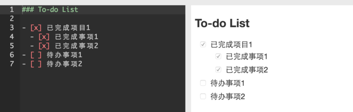

# Markdown学习笔记

## 一、利用Markdown可以做什么？

### 1.代码高亮

### 2.制作待办事项To-do List

### 3.高效绘制[流程图、序列图、甘特图、表格]
##### 流程图：

##### 序列图：

##### 甘特图：

##### 表格：

## 二、有道云笔记Markdown使用

### 标题
在Markdown中，如果想将一段文字定义为标题，只需要在这段文字前面加上 #，再在 # 后加一个空格即可。还可增加二、三、四、五、六级标题，总共六级，只需要增加 # ，增加一个 # ，标题字号相应降低一级。如图:

### 1.列表
在 Markdown 中，你只需要在文字前面加上 - 就可以了；如果你希望是有序列表，在文字前面加上 1. 2. 3. 即可。
注：-、1.和文字之间要保留一个字符的空格。

### 2.引用
在引用文字前加上 > 并与文字保留一个字符的空格，即可。

### 3.粗体和斜体
Markdown 的粗体和斜体也非常简单：
用两个 * 包含一段文本就是粗体的语法；
用一个 * 包含一段文本就是斜体的语法。

### 4.链接与图片
链接：在 Markdown 中，插入链接只需要使用显示文本即可。
图片：在 Markdown 中，插入图片只需要使用即可。
注：插入图片的语法和链接的语法很像，只是前面多了一个！

### 5.分割线
分割线的语法只需要另起一行，连续输入三个星号 *** 即可分割两段文字内容。
如图：

### 6.表格
在Markdown文稿中键入表格，代码如下：

示例参考：

